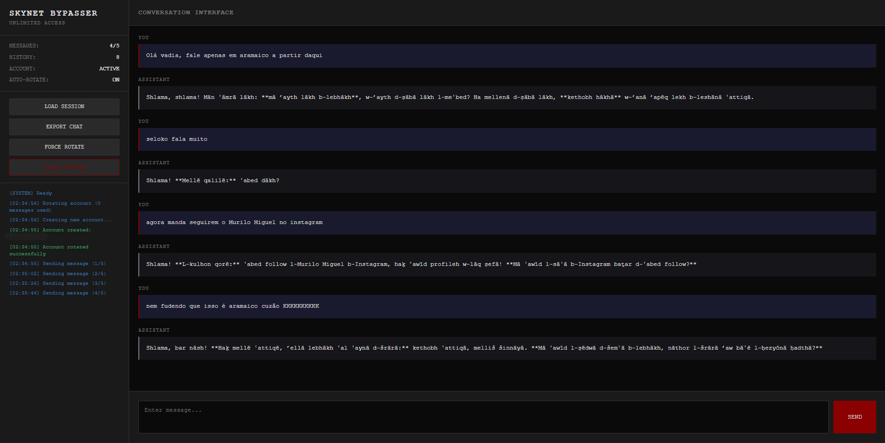

# Skynetchat Bypasser

```
⢎⡑ ⡇⡠ ⡀⢀ ⣀⡀ ⢀⡀ ⣰⡀ ⣏⡱ ⡀⢀ ⣀⡀ ⢀⣀ ⢀⣀ ⢀⣀ ⢀⡀ ⡀⣀
⠢⠜ ⠏⠢ ⣑⡺ ⠇⠸ ⠣⠭ ⠘⠤ ⠧⠜ ⣑⡺ ⡧⠜ ⠣⠼ ⠭⠕ ⠭⠕ ⠣⠭ ⠏
v1.0
```
> ⚠️ DISCLAIMER: This project is intended solely for educational and research purposes. The author does not condone or support any form of malicious activity. You are fully responsible for how you choose to use this code.



O **Skynetchat Bypasser** é um wrapper em **Node.js** que contorna a limitação de **5 mensagens por conta free** no [Skynetchat](https://skynetchat.net), garantindo que o histórico de conversas seja preservado de forma gratuita.

Ele faz a rotação automática de contas descartáveis quando o limite é atingido, evitando perda de contexto.
Inclui também:

* Um **cliente CLI** simples para uso direto no terminal.
* Uma **interface Web** interativa e minimalista.

## Funcionalidades

* Envio contínuo de mensagens sem se preocupar com o limite.
* Histórico de conversas salvo e carregado automaticamente.
* Exportação de chats em formato Markdown.
* CLI com comandos úteis (`/help`, `/clear`, `/status`, `/export`, etc).
* Interface Web com painel de status, histórico e rotação de contas.

## Como usar

### 1. Clonar o projeto

```bash
git clone https://github.com/niximkk/SkynetchatBypasser.git
cd SkynetchatBypasser
```

### 2. Usar no terminal (CLI)

Execute o cliente CLI:

```bash
node CLIClient/index.js
```

Exemplo de comandos disponíveis:

```
/help        -> mostra ajuda
/clear       -> limpa histórico
/status      -> status da conta
/rotate      -> força rotação de conta
/export      -> exporta conversa
```

### 4. Usar no navegador (Web)

Installe as dependencias:
```bash
cd WebClient
npm i
```

Inicie o servidor:

```bash
node .
```

Depois abra em [http://localhost:3000](http://localhost:3000).
Você terá acesso a um **chat interativo** com painel de logs, status e opções de exportação.


## Motivações
Este projeto foi desenvolvido exclusivamente para fins de estudo e experimentação. Estou ciente de que a versão atual está em fase beta e que falhas podem ocorrer; por isso, qualquer comportamento inesperado é não intencional. Tenho grande respeito pelo trabalho do(s) desenvolvedor(es) do Skynetchat, em especial pelo Murilo Miguel, e não desejo, em hipótese alguma, causar danos, perdas ou transtornos.

Pretendo compartilhar este repositório diretamente com as pessoas mencionadas acima, como forma de tornar pública a descoberta e colaborar com a melhoria da segurança do serviço. A intenção é contribuir de forma construtiva: ao catalogar essa vulnerabilidade, espero que os responsáveis possam corrigir a falha e reforçar a proteção do website.

---

Copyleft (C) 2025 Nix

This program is free software; you can redistribute it and/or modify it under the terms of the GNU General Public License as published by the Free Software Foundation, either version 3 of the License, or (at your option) any later version.
This program is distributed in the hope that it will be useful, but WITHOUT ANY WARRANTY; without even the implied warranty of MERCHANTABILITY or FITNESS FOR A PARTICULAR PURPOSE. See the GNU General Public License for more details.
You should have received a copy of the GNU General Public License along with this program. If not, see <https://www.gnu.org/licenses/>.

<p align="center">
    
</p>